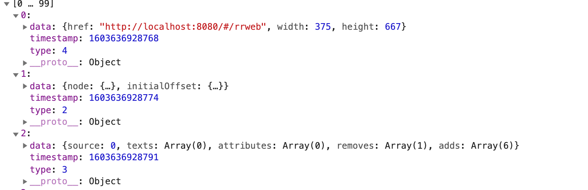
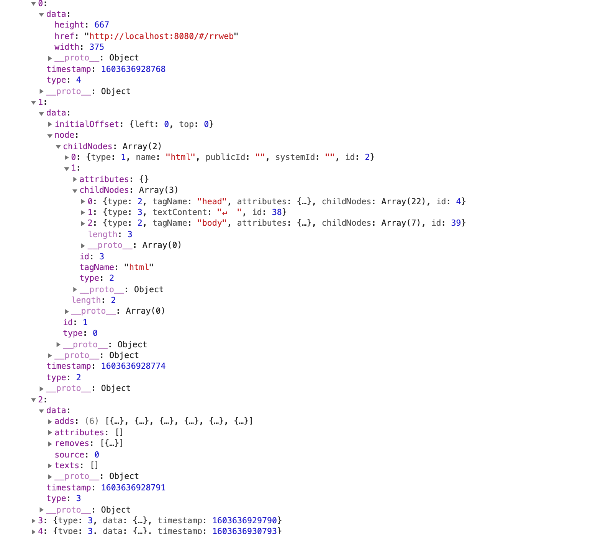

#### 
浅谈rrweb

rrweb全称`Record and replay the web`, 可以对web页面进行录制、回放，也可以将⻚⾯中的 DOM 以及⽤户操作保存为可序列化的数据，以实现远程回放的一个开源的第三方库。

##### 为什么使用rrweb？
产品在客户使用中出现问题，只能通过远程工具在客户环境中进行debug；或者客户在使用产品的过程中操作出一些偶然性的bug，比如页面中的显示数据和保存的数据不一致、闪现出不该出现的元素部分等。虽然可以通过完善前端的`异常监控`，结合后端记录的日志来分析问题，但没法准确的定位出当时客户操作的场景和页面对应的数据。

所以使用`rrweb`可以对当时的客户的操作和页面的内容进行录制和回放，能够准确的定位到问题所在，迅速复现和解决问题。

##### 使用场景
> 记录客户操作场景和数据，迅速复现解决。
> 记录客户使用产品的方式和习惯，优化产品。
> 录制产品演⽰。
> 记录 CI 环境中的 E2E 测试的执⾏情况。
> 直播

##### 组成部分
`rrweb` 主要由 3 部分组成:

`rrweb-snapshot` 包含 `snapshot` 和 `rebuild` 两个功能。`snapshot` 用于将 `DOM` 及其状态转化为可序列化的数据结构并添加唯一标识；`rebuild` 则是将 `snapshot` 记录的数据结构重建为对应的 `DOM`。
> 如图所示：
> 
> 
> 
> 

`rrweb` 包含 `record` 和 `replay` 两个功能。`record`用于记录 `DOM` 中的所有变更（`mutation`）；`replay` 则是将记录的变更按照对应的时间一一重放。

`rrweb-player` 为 `rrweb` 提供一套 UI 控件，提供基于 GUI 的暂停、快进、拖拽至任意时间点播放等功能。

[官方demo](https://www.rrweb.io/#demos)
[社区](http://www.myriptide.com/rrweb-community-cn/)
