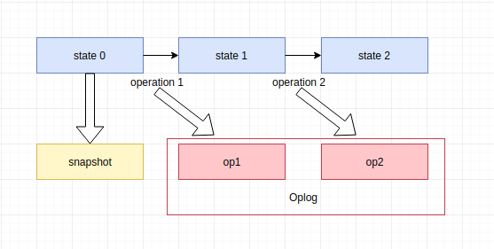

#### <center>浅谈rrweb</center>

rrweb全称`Record and replay the web`, 可以对web页面进行录制、回放，也可以将⻚⾯中的 DOM 以及⽤户操作保存为可序列化的数据，以实现远程回放的一个开源的第三方库。

##### 为什么使用rrweb？
产品在客户使用中出现问题，只能通过远程工具在客户环境中进行debug；或者客户在使用产品的过程中操作出一些偶然性的bug，比如页面中的显示数据和保存的数据不一致、闪现出不该出现的元素部分等。虽然可以通过完善前端的`异常监控`，结合后端记录的日志来分析问题，但没法准确的定位出当时客户操作的场景和页面对应的数据。

所以使用`rrweb`可以对当时的客户的操作和页面的内容进行录制和回放，能够准确的定位到问题所在，迅速复现和解决问题。

##### 使用场景
> 记录客户操作场景和数据，迅速复现解决。
> 记录客户使用产品的方式和习惯，优化产品。
> 录制产品演⽰。
> 记录 CI 环境中的 E2E 测试的执⾏情况。
> 直播

##### 组成部分
`rrweb` 主要由 3 部分组成:

`rrweb-snapshot`， 包含 `snapshot` 和 `rebuild` 两个功能。

`snapshot` 将遍历 `DOM` 及其状态，转化为可序列化的数据结构，并添加唯一标识；

如果只是本地录制和回放，我们通过将 DOM 对象深克隆在内存中就实现快照。
```javascript
// clone 
const doc = document.documentElement.cloneNode(true)

// replay
document.replaceChild(doc, document.documentElement);
```
但是这个快照对象本⾝并不是可序列化的，因此我们不能将其保存为特定的⽂本格式（例如 `JSON`）进⾏传输，也就⽆法做到远程录制。不可序列化是指我们可以通过元素对象来获取到 `DOM` 的属性值，但会丢失⼀些视图状态，如 `input` 的 `value` 就不⼀定会记录在 `HTML` 中。

1. 将某些 `DOM` 状态内联到 `HTML` 属性中，如 `input` 的 `value`。
2. 将 `script` 转换为 `noscript` ，在 `iframe` 沙盒中不执行脚本。
3. 尝试内联样式表，以确保可以使用本地样式表。
4. 将 `href`，`src`，`css` 中的相对路径转成绝对路径。
5. 为每个节点指定一个 `id`，并在快照完成后返回 `id` 节点映射。

`rebuild` 则是将 `snapshot` 记录的数据结构重建为对应的 `DOM`。

1. 如果节点是元素，则添加 `data-rrid` 属性。
2. 创建一些额外的 `DOM` 节点（例如文本节点）来放置内联 `CSS` 和某些状态。
3. 如果节点具有一些额外的子`DOM`，则添加 `data-extra-child-index` 属性。

> 如图所示：
> 
> 
> 
> 

**[serializeNodeWithId](https://github.com/rrweb-io/rrweb-snapshot/blob/master/src/snapshot.ts)**  将节点序列化为具有ID的快照格式。
**[buildNodeWithSN](https://github.com/rrweb-io/rrweb-snapshot/blob/master/src/rebuild.ts)** 从序列化的节点构建DOM并将序列化的信息存储在	`__sn` 属性中。

`rrweb`， 包含 `record` 和 `replay` 两个功能。

`record`用于记录 `DOM` 中的所有变更 (`mutation`)；
`replay` 则是将记录的变更按照对应的时间一一重放。

录制方案：`snapshot` + `Oplog（operations log）`

引发视图变更的操作归为以下⼏类:

> `DOM`变动（节点创建、销毁，节点属性变化，⽂本变化）
> ⿏标移动，交互
> ⻚⾯或元素滚动
> 视窗⼤⼩改变
> `Input`输入

通过记录每个操作的类型和相关的数据，来实现视图改变的回放。
开始录制时制作⼀个完整的 `DOM` 快照，之后记录所有的操作数据，这些操作数据我们称之为 `Oplog` (`operations log`)。



利用浏览器提供的 `API` - [`MutationObserver`](https://developer.mozilla.org/zh-CN/docs/Web/API/MutationObserver) 来完成记录 `DOM` 节点的变动。

回放功能是将被录制的 `DOM` 重建在⼀个 `iframe` 元素中，通过`HTML` 提供的 `iframe` 沙盒功能（[`sandbox`](https://www.w3school.com.cn/tags/att_iframe_sandbox.asp)属性）进⾏浏览器层⾯的限制：
> 脚本执行 (`allow-forms`)
> 表单提交 (`allow-scripts`)
> 允许 `iframe` 内容被视为与包含文档有相同的来源 (`allow-same-origin`)
> 允许 `iframe` 内容从包含文档导航（加载）内容 (`allow-top-navigation`)


录制端和回放端维护一份相同的 `id` -> `Node` 映射，将 `Oplog` 中交互的 `DOM` 节点和已存在的 `DOM` 关联在⼀起。将 `Oplog` 中的操作按照时间戳排列，放⼊⼀个操作队列中。启动⼀个计时器，不断检查操作队列，将到时间的操作取出重现，实现对应的回放功能。


`rrweb-player`， 为 `rrweb` 提供一套 基于[svelte app](https://svelte.dev/) 的UI 控件，提供基于 GUI 的暂停、快进、拖拽至任意时间点播放等功能。

##### 使用
`rrweb`可以通过外部引入或者 `node`包 (`npm`)的方式引入。
由于使用 `MutationObserver API`，`rrweb` 不支持 `IE11` 以下的浏览器。兼容的[浏览器](https://caniuse.com/mutationobserver)列表。

`rrweb` 在录制阶段会不断将 `event` 传递给配置的 `emit` 方法：
```javascript
const allEvents = []
const stopRecordFn = rrweb.record({
   emit (event) {
     allEvents.push(event)
   }
})
```

`record`的配置参数

> 
> emit - required -  获取当前录制的数据
> checkoutEveryNth - 每 N 次事件重新制作一次全量快照，如 200
> checkoutEveryNms -	 每 N 毫秒重新制作一次全量快照， 如 1000 * 60 * 10
> blockClass - rr-block - 字符串或正则表达式，可用于自定义屏蔽元素的类名
> ignoreClass - rr-ignore - 字符串或正则表达式，可用域自定义忽略元素的类名
> maskAllInputs - false - 将所有输入内容记录为 *
> maskInputOptions - {} - 选择将[特定类型](https://github.com/rrweb-io/rrweb-snapshot/blob/6728d12b3cddd96951c86d948578f99ada5749ff/src/types.ts#L72)的输入框内容记录为 *
> inlineStylesheet - true - 是否将样式表内联
> hooks - {} - [各类事件](https://github.com/rrweb-io/rrweb/blob/9488deb6d54a5f04350c063d942da5e96ab74075/src/types.ts#L207)的回调
> packFn - 数据压缩函数，[优化存储](https://github.com/rrweb-io/rrweb/blob/master/docs/recipes/optimize-storage.zh_CN.md)
> sampling - 数据抽样策略，[优化存储](https://github.com/rrweb-io/rrweb/blob/master/docs/recipes/optimize-storage.zh_CN.md)
> recordCanvas - false - 是否记录 canvas 内容
> collectFonts - false - 是否记录页面中的字体文件
> 

默认情况下，要重放内容需要所有的 `event`，如果你不想存储所有的 `event`，可以使用 `checkout` 配置。
```javascript
const allEvents = [[]]
const stopRecordFn = rrweb.record({
   emit (event, isCheckout) {
     isCheckout && allEvents.push([])
     allEvents[allEvents.length - 1].push(event)
   },
   checkoutEveryNth: 200,
   // checkoutEveryNms: 1000 * 60,
   maskInputOptions: {
     number: true
   },
   // maskAllInputs: true,
})
```

可以通过`rrweb`的 API `Replayer`来控制回放功能。

```javascript

const replayer = new rrweb.Replayer(events, options)

replayer.play(ms) // 开始播放

replayer.pause(ms) // 暂停播放

```
通过 `API` 控制回放，可以传入参数（毫秒）来控制播放或者暂停的时间节点。

> 
> 参数列表
> speed - 1 - 回放倍速
> root - document.body - 回放时使用的 HTML 元素
> loadTimeout - 0 - 加载异步样式表的超时时长
> skipInactive - false - 是否快速跳过无用户操作的阶段
> showWarning - true - 是否在回放过程中打印警告信息
> showDebug - false - 是否在回放过程中打印 debug 信息
> blockClass - rr-block - 需要在回放时展示为隐藏区域的元素类名
> liveMode - false - 是否开启直播模式
> inertStyleRules - [ ] - 可以传入多个 CSS rule string，用于自定义回放时 iframe 内的样式
> triggerFocus - true - 回放时是否回放 focus 交互
> UNSAFE_replayCanvas - false - 回放时是否回放 canvas 内容，开启后将会关闭沙盒策略，导致一定风险
> mouseTail - true - 是否在回放时增加鼠标轨迹。传入 false 可关闭，传入对象可以定制轨迹持续时间、样式等，配置详见类型
> unpackFn - 数据解压缩函数
> 

也可使用 `rrweb-player`
```javascript
this.player = new RrwebPlayer({
    target: document.querySelector('.player-box'),
    props: {
	    events: JSON.parse(events),
	    width: this.playerConfig.width * 0.8,
	    height: this.playerConfig.height * 0.8,
	    unpackFn: rrweb.unpack
	}
})
```
> 增加的配置
> events - [ ] -包含回放所需的数据
> width - 1024 - 播放器宽度
> height - 576 - 播放器高度
> autoPlay - true - 是否自动播放
> speedOption - [1, 2, 4, 8] - 倍速播放可选值
> showController - true - 是否显示播放器控制 UI
> tags - { } - 可以以 key value 的形式展示自定义事件在时间轴上的颜色

如果需要监听回放时的各类事件，例如在跳过无用户操作的时间时给用户一些提示。
`rrweb` 的 `Replayer` 提供了 `on` API 用于提供该功能，[事件列表](https://github.com/rrweb-io/rrweb/blob/master/guide.zh_CN.md#%E4%BA%8B%E4%BB%B6)
```javascript
const replayer = new rrweb.Replayer(events);
replayer.on(EVENT_NAME, (payload) => {
  // ...
})
```
如果录制的`events`数据过大，需要进行数据拼接，或者异步获取数据后回放。可以通过
```javascript
const replayer = new rrweb.Replayer(events)

replayer.addEvent(NEW_EVENT)

// 或者
for (const event of NEW_EVENTS) {
  replayer.addEvent(event)
}
```
只需要调用 `addEvent` 传入新的数据，`rrweb` 就会自动处理其中的时间关系进行回放。


[rrweb 场景](https://github.com/rrweb-io/rrweb/blob/master/docs/recipes/index.zh_CN.md)
[官方demo](https://www.rrweb.io/#demos)
[社区](http://www.myriptide.com/rrweb-community-cn/)
